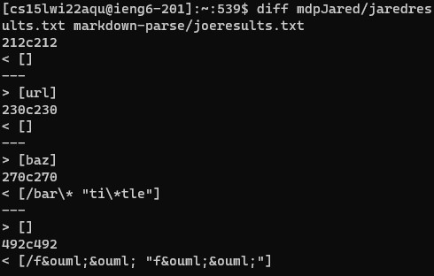
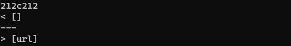
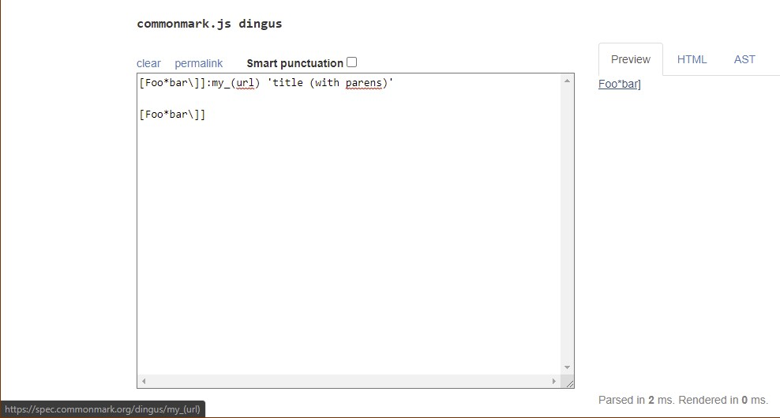
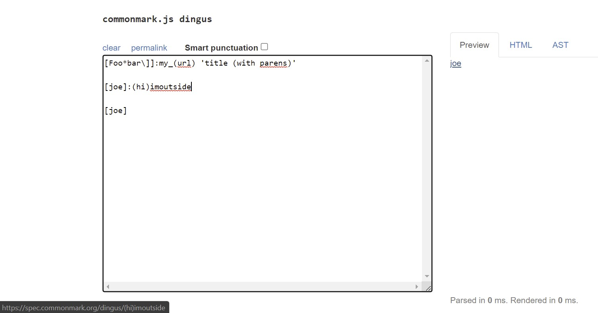
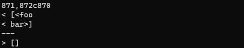
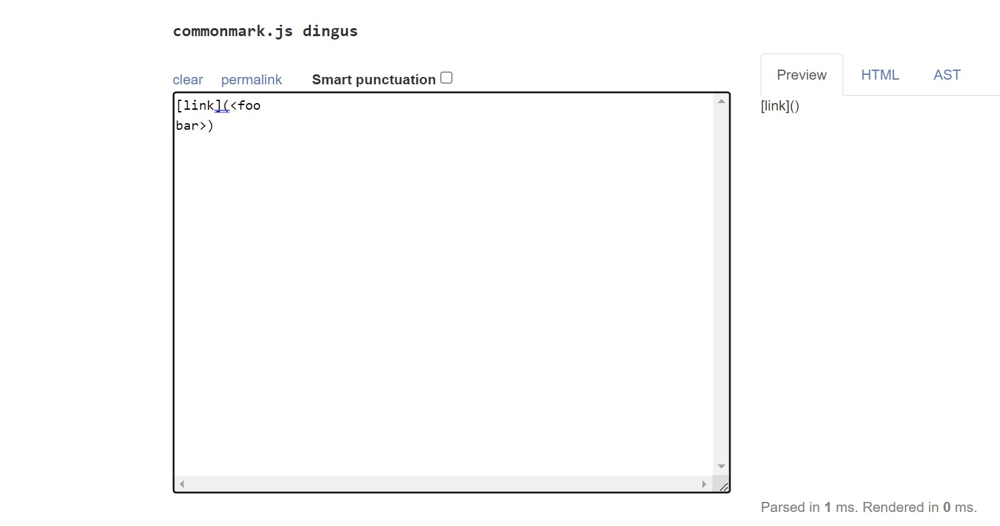

# **Lab Report Week 8**
#### Written by Neo Torres

Links:
[Homepage](https://nickpizzablock.github.io/cse15l-lab-reports/)

## Comparing Professor Joe's code with mines

[My Group's MarkdownParse Repo](https://github.com/JaredJose/markdown-parse)

### Finding the different results
During our lab on week 9, we made bash scripts to see the results using for loops of the professor's and my code without using testers. `script.sh` is the following...

````
for file in test0files/*.md;
do
  echo $file
  java MarkdownParse $file
done
````

Then we can put those results into `.txt` files using `bash script.sh > result.txt`. After, we used the `diff` command to compare our results using `diff mdpJared/jaredresults.txt markdown-parse/joeresults.txt`.



In this snippet, the left one is mine and the right one is the professor's.

Finally, I manually checked the line of the test file to find the corresponding test by scp-ing one of the result.txt files into my computer and looking at line numbers with an IDE.

### Difference 1
The first difference is on file `194.md`. Here's the contents.

````
[Foo*bar\]]:my_(url) 'title (with parens)'

[Foo*bar\]]

````


My result: `[]`

Professor's result: `[url]`



[According to CommonMark](https://spec.commonmark.org/dingus/), the correct answer is `[my_(url)]`, so we both got it wrong.



It seems like there is a special case with colons where after a set of brackets `[]`. If the text in the brackets are the same on a different line, the link would be the text after the colon in the same line. Look at this example above for another example. Hmmm... weird.

Since this seems like a new case, we would have to add code to detect if there is a set of brackets and a colon. Then, save the text after the colon in a variable. When we detect the same brackets with same text inside, if there are no following parenthesis, provide the variable we just saved as a url.


### Difference 2

The first difference is on file `490.md`. Here's the contents.

````
[link](<foo
bar>)

````


My result: `[foo /n bar]` (`/n` is the escape key like a next line)

Professor's result: `[]`



According to CommonMark, the correct answer is `[]`, so the professor is correct.

My code was incorrect as it does not handle escape keys correctly. I believe we need to add the potentialLink part of the professor's code in order to detect links that are separated by an escape key.

Additionally, we should exclude text at and within `<` and  `>` pairs within the links. We would probably have to add `int nextLessThanSign = markdown.indexOf("<");` and `int nextGreaterThanSign = markdown.indexOf(">");` within looking for the parenthesis part of the code.

## <b> YAY, THIS CLASS IS OVER! WOOOOOOOO!!! </b>

<iframe src="https://giphy.com/embed/dNgK7Ws7y176U" width="480" height="331" frameBorder="0" class="giphy-embed" allowFullScreen></iframe><p><a href="https://giphy.com/gifs/homework-dNgK7Ws7y176U">via GIPHY</a></p>

^ me now that I know how to use Github and SSH

##### unless I did something wrong and I have to resubmit this lab again 🙃

###### also, I still need to study for other classes 😭 