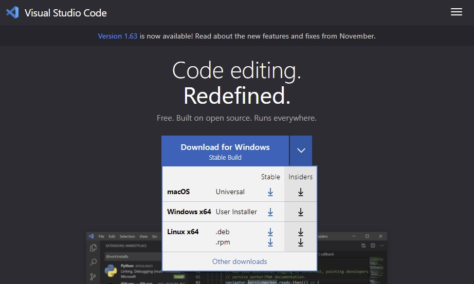
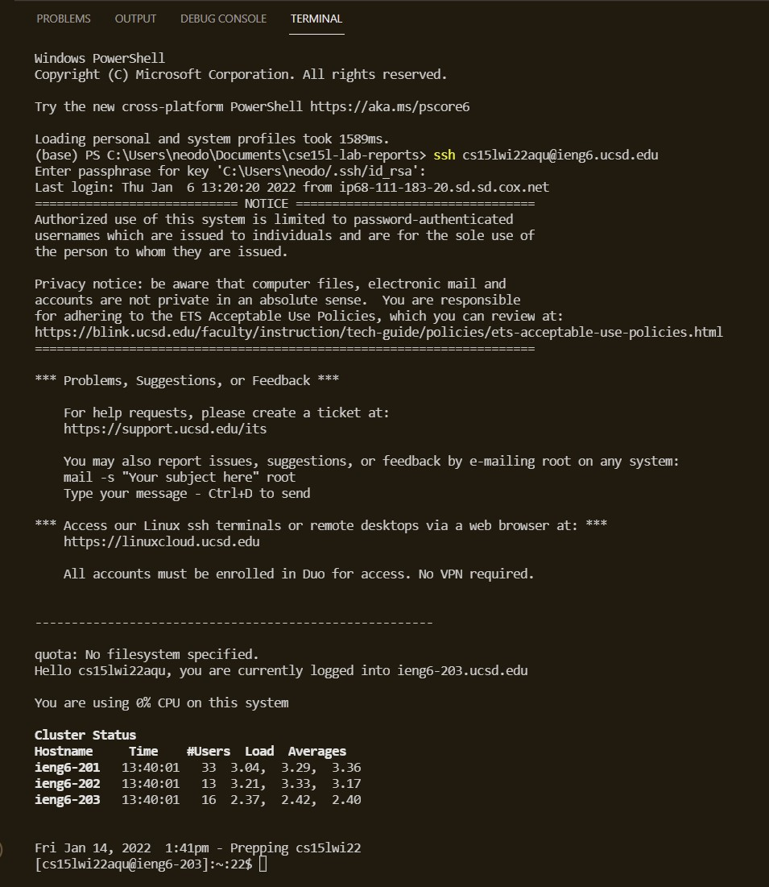
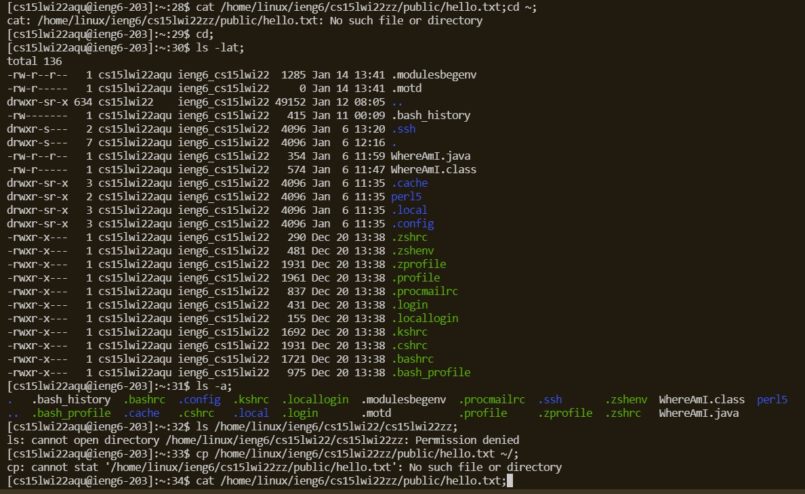
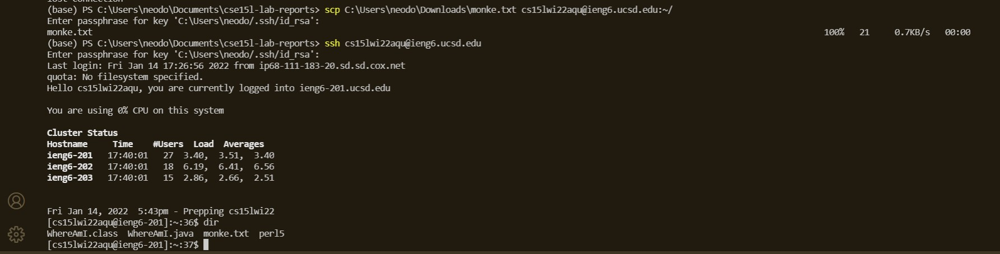
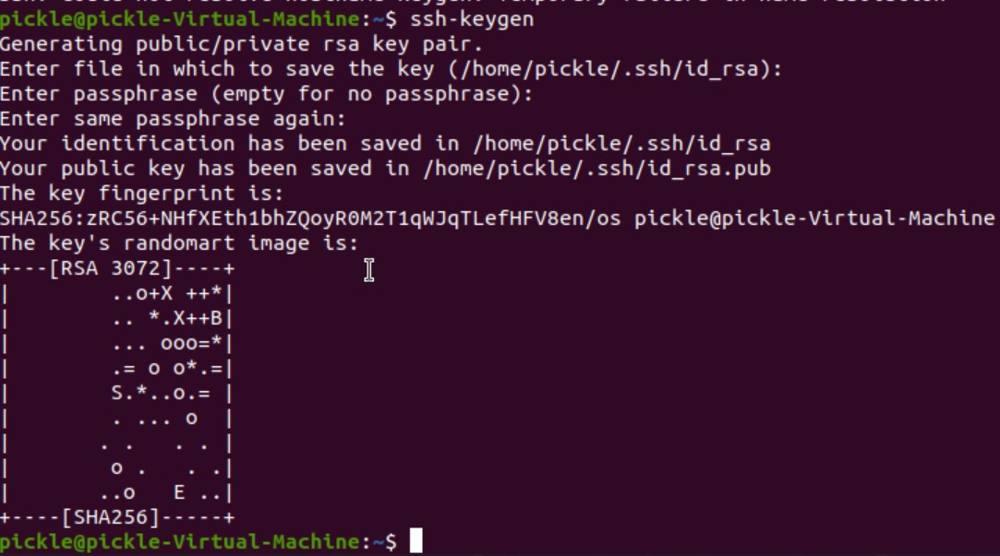
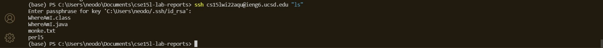

**Lab Report Week 2**
#### Written by Neo Torres

[Homepage]https://Nickpizzablock.github.io/cse15l-lab-reports/
 
<!-- TODO:
- [!] Installing VScode
- [ ] Remotely Connecting
- [ ] Trying Some Commands
- [ ] Moving Files with scp
- [ ] Setting an SSH Key
- [ ] Optimizing Remote Running -->

## Installing VScode
1. Go to [https://code.visualstudio.com/](https://code.visualstudio.com/).
2. Click the download button appropriate for your operating system.
3. Follow through the instructions on screen.

 

 

## Remotely Connecting
1. Install **OpenSSH** on Windows by going to Settings > Apps > Apps and Features > Optional features > Add a feature
2. Install **OpenSSH Client** and **OpenSSH Server**
2. Locate your **UCSD account** at [https://sdacs.ucsd.edu/~icc/index.php](https://sdacs.ucsd.edu/~icc/index.php).
3. In VSCode, use the command **Ctrl + shift + '** to open a terminal.
4. Type this in the terminal but replace zz with your account.
>ssh cs15lwi22zz@ieng6.ucsd.edu
5. Type **Yes** and then your password in the terminal to connect.
6. To close, type exit.

 

 

## Trying Some Commands
* cd ~
* cd
* ls -lat
* ls -a
* ls /home/linux/ieng6/cs15lwi22/cs15lwi22zz
* cp /home/linux/ieng6/cs15lwi22zz/public/hello.txt ~/
* cat /home/linux/ieng6/cs15lwi22zz/public/hello.txt
<!-- 
cd ~;
cd;
ls -lat;
ls -a;
ls /home/linux/ieng6/cs15lwi22/cs15lwi22zz;
cp /home/linux/ieng6/cs15lwi22zz/public/hello.txt ~/;
cat /home/linux/ieng6/cs15lwi22zz/public/hello.txt;
 -->

## Moving Files with scp
1. To send, go to directory of target file.
2. Type 
>scp (FileName) cs15lwi22zz@ieng6.ucsd.edu:~/
3. Put in password

 

 

## Setting an SSH Key
1. On client side, type
>ssh-keygen 

2. Save the key to the default directory
3. Make a password and confirm
4. Open Powershell as Administrator and enter the following commands (the private key is the file without .pub)
>Get-Service ssh-agent | Set-Service -StartupType Manual
Start-Service ssh-agent
Get-Service ssh-agent
ssh-add (Directory of private key)
5. Login into server and enter
>mkdir .ssh
6. Go back to client and type
>scp (directory of Public Key) cs15lwi22zz@ieng6.ucsd.edu:~/.ssh/authorized_keys

 

##### (I put this in a Linux virtual machine because I am not sure what happens when you do ssh-keygen with a computer that already has a key)
 

## Optimizing Remote Running

* Writting a command in quotes will run on the server directory 
>ssh cs15lwi22zz@ieng6.ucsd.edu "ls"

* Semicolons allow for running multiple commands in the same line
>cp WhereAmI.java OtherMain.java; javac OtherMain.java; java WhereAmI

