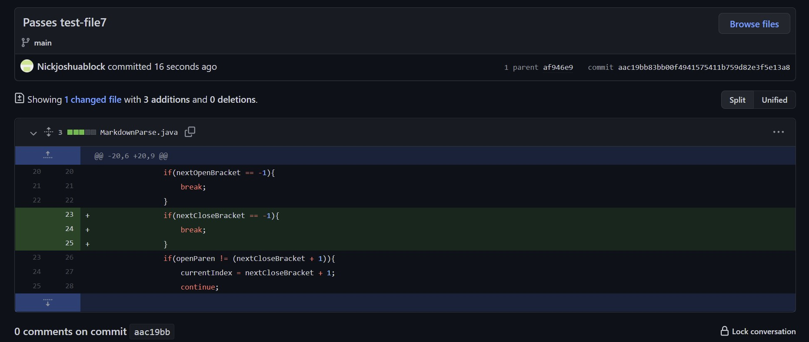
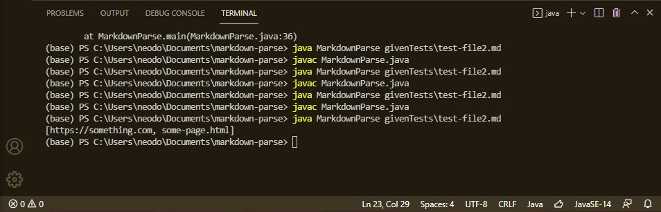
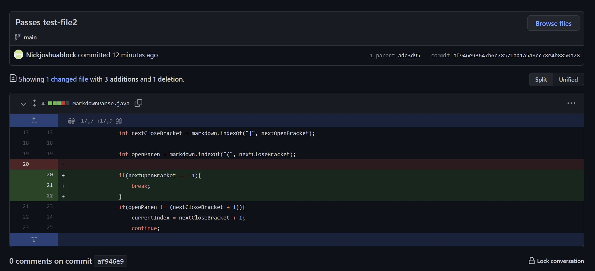
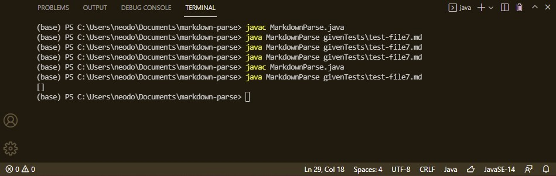
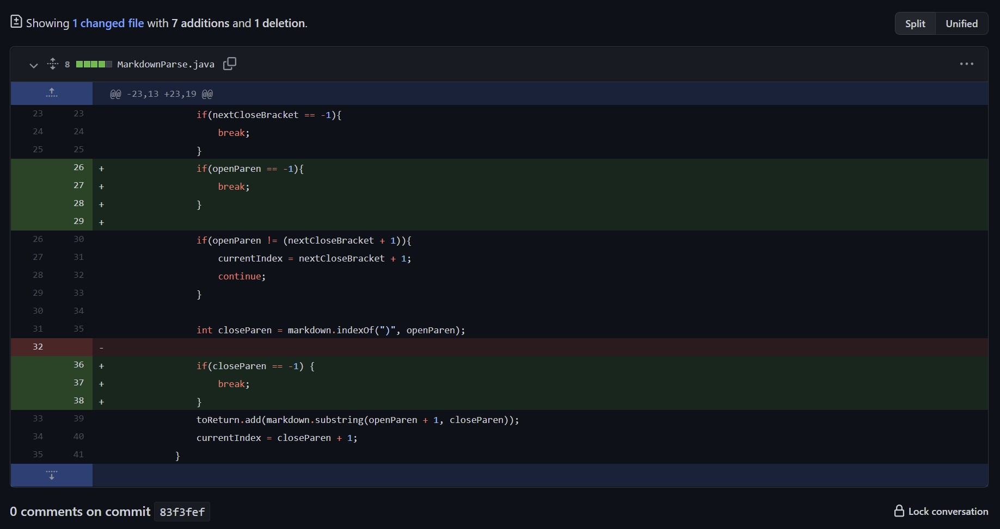
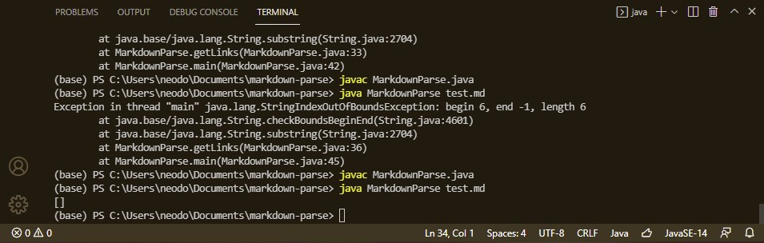

# **Lab Report Week 4**
#### Written by Neo Torres

Links:
[Homepage](https://nickpizzablock.github.io/cse15l-lab-reports/)

<!-- Pick three code changes that your group worked on in labs 3 and 4 in order to fix a bug; these should be stored as commits on someone’s repository. Fork the repository so you have your own copy with all the work your group did if you haven’t already. -->

## Code Change 1 - nextCloseBracket
### Code Change Difference

### Link to Test File
[Joe Politz test-file2.md](https://github.com/ucsd-cse15l-w22/markdown-parse/blob/main/test-file2.md)
### Symptom

### Relationship Between Them
The failure-inducing input was test-file2.md which was running an infinite loop. There was text following the link which was why the continue kept running.

## Code Change 2 - nextOpenBracket
### Code Change Difference

### Link to Test File
[Joe Politz test-file2.md](https://github.com/ucsd-cse15l-w22/markdown-parse/blob/main/test-file7.md)
[Joe Politz test-file2.md](https://github.com/ucsd-cse15l-w22/markdown-parse/blob/main/test-file8.md)
### Symptom

### Relationship Between Them
The failure-inducing input was test-file7.md and test-file8.md also having an infinite loop. Because the program kept on running, it was probably because it cannot find the appropriate next character.

## Code Change 3 - closeParen
### Code Change Difference

### Link to Test File
[Neo Torres test.md](https://github.com/Nickpizzablock/markdown-parse/blob/main/new.md)
### Symptom

### Relationship Between Them
The failure-inducing input was my own test which was missing an end parenthesis and giving a string out of bounds error. Again, I put code to break the loop when an end parentesis was not detected.