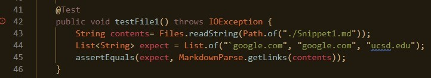
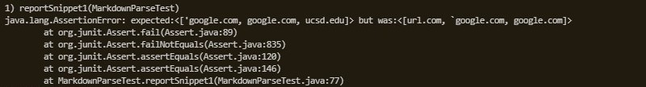
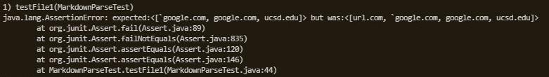
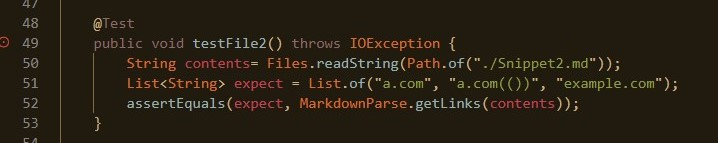
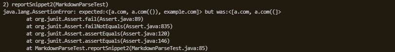
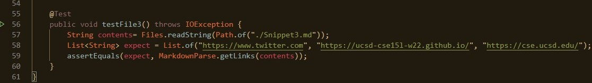
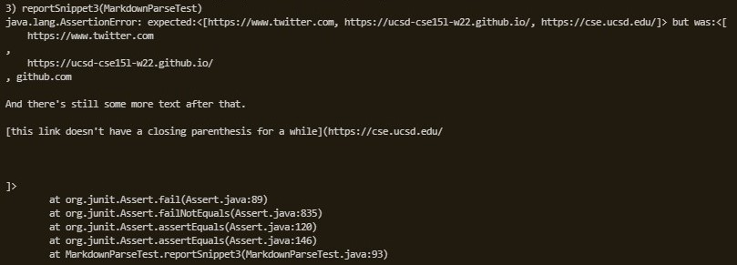
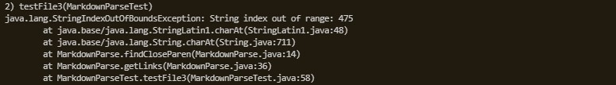

# **Lab Report Week 8**
#### Written by Neo Torres

Links:
[Homepage](https://nickpizzablock.github.io/cse15l-lab-reports/)

Here are the repos I used:
[My Group's Repo](https://github.com/JaredJose/markdown-parse)

[The Reviewed Repo](https://github.com/ucsd-cse15l-w22/markdown-parse)

## Who has the better program? Professor Joe vs. Me
We are given 3 tests and we will see who's code will pass more tests. 

## NOTE: 
The definition of a link will be set by VSCode Preview's interpretation. Anything with the hyperlink should be detected by MarkdownParse. The link doesn't have to be a functioning link, as long as it is detected in VSCode's preview.

### Test 1

The test should list `` `google.com``, `google.com`, and `ucsd.edu`.

#### My Implementation = FAIL

#### Joe's Implementation = FAIL

#### Solutions
For situations with backticks, a solution would be if a backtick is detected, then if there is an open parenthesis or bracket before the next backtick using `.indexOf`, start looking for the next link (break). This should be less than 10 lines. 

### Test 2

The test should list `a.com`, `a.com(())`, and `example.com`.

#### My Implementation = FAIL

#### Joe's Implementation = PASS

#### Solutions
For nest parentheses, brackets, and escaped brackets, if an `[` is detected, if there is also a matching `]` followed by a `(` and `)`, that link should be prioritized. There should be a recursive method like a while loop to make sure the program can take multiple nested links.
<!-- way to remember how many of the same parentheses, brackets, and escaped brackets is repeated and match their open with closed. Like if there is a `[` then an `[`, the code should start  -->

### Test 3

The test should list `https://www.twitter.com`, `https://ucsd-cse15l-w22.github.io/`, and `https://cse.ucsd.edu/`.

#### My Implementation = FAIL

#### Joe's Implementation = FAIL

#### Solutions
For newlines in brackets and parentheses, there should be a way to remove the newlines from the list. Maybe after the main while loop is done, check if each element of the list has a newline and remove if so. Aside from newlines, we need to detect if there is an open bracket after finding the open parenthesis so that it doesn't encapsulate another link. 

GGWP Joe. You win this time...
